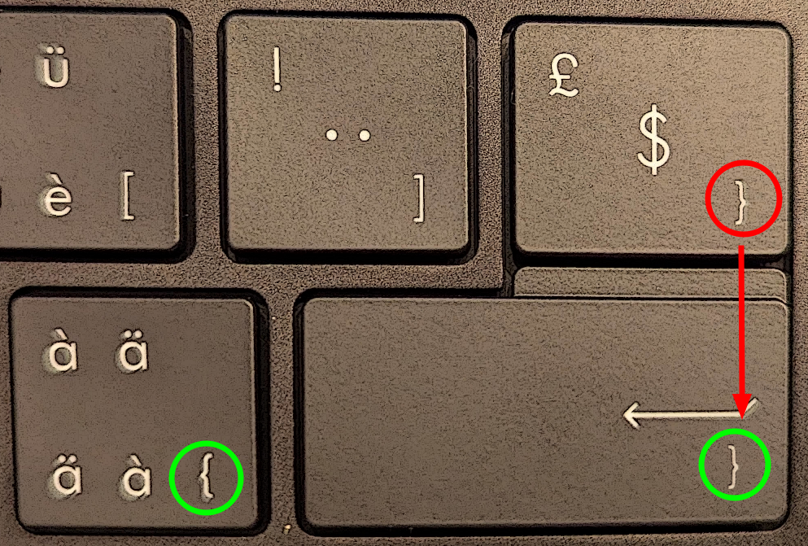

Swiss Keyboard Layout - Someone thought it would be no big deal to move the
close brace key to an off position instead of having it next to the open brace
key. This may not be a big deal for the casual user, but for a developer who
needs that key all the time, it is a real pain. The following patch to the
Swiss layout allows you to press Alt+Enter to insert a closing brace right next
to the opening brace, as it should be.

```
% diff -u /usr/share/X11/xkb/symbols/ch.bak /usr/share/X11/xkb/symbols/ch
--- /usr/share/X11/xkb/symbols/ch.bak	2024-07-26 21:14:14.776300593 +0200
+++ /usr/share/X11/xkb/symbols/ch	2024-07-26 22:51:35.410229376 +0200
@@ -30,6 +30,7 @@
     key <AC10>	{[ odiaeresis,     eacute                           ]};
     key <AC11>	{[ adiaeresis,     agrave,    braceleft             ]};
     key <BKSL>	{[     dollar,   sterling,   braceright             ]};
+    key <RTRN>	{[     Return,     Return,   braceright             ]};
 
     key <LSGT>	{[       less,    greater,    backslash,  brokenbar ]};
     key <AB01>	{[          y,          Y                           ]};
```

Works also for Wayland despite `X11` in the path.

To apply the changes run the following command (for Debian based distros) and
reboot your machine:

```shell
# dpkg-reconfigure xkb-data
```
